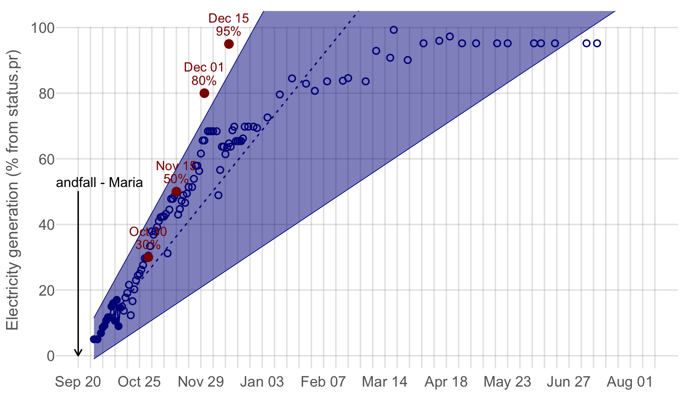

## Re-Energinzing Puerto Rico

On October 14, 2017, the government of Puerto Rico announced targets for achieving 95% coverage by 
[December 15](https://twitter.com/fortalezapr/status/919201514073321472). 
At the time the coverage was fluctuating on a daily basis, hitting 9% on October 13 and 14.6% on October 14. 
To assess progress towards the four targets announced on October 14 (red points), 
I used reported coverage up to that date (connected blue points), to estimate a linear increase in coverage of 0.4-1.0% per day 
(dashed blue line and shaded 95% Confidence Interval), and compared to subsequently reported data (open blue points).

More resources are being brought to Puerto Rico to help repair and replace the electricity grid, but the challenge is immense. 
More than three weeks after Maria struck Puerto Rico when these targets were announced, 
only 10-15% of the island had electricity, mostly in the metropolitan area where power lines and transfer stations 
are relatively accessible. Outside of the metropolitan area, the challenge is much greater.

*October 21 Update: One week after announcing the targets, the electric authority reported that 16.6% of Puerto Rico had electricity, fluctuating on a daily basis. While linear progress continues, it is **not** on track to meet the goal of 95% coverage by December 15.*

### Electricity coverage in Puerto Rico after Hurricane Maria ([StatusPR](http://status.pr/))

