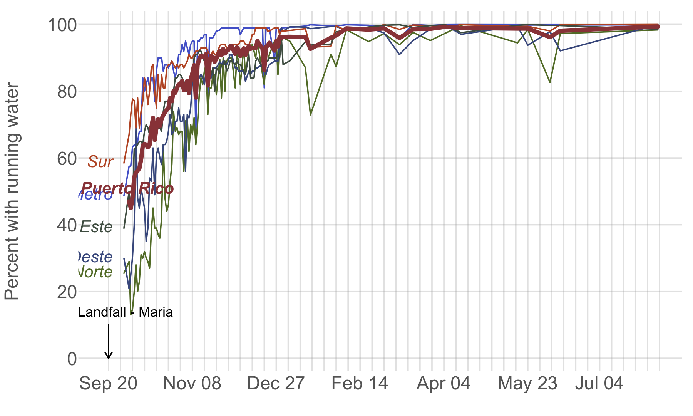
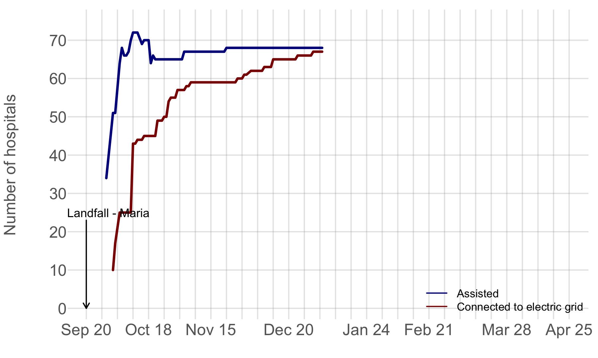
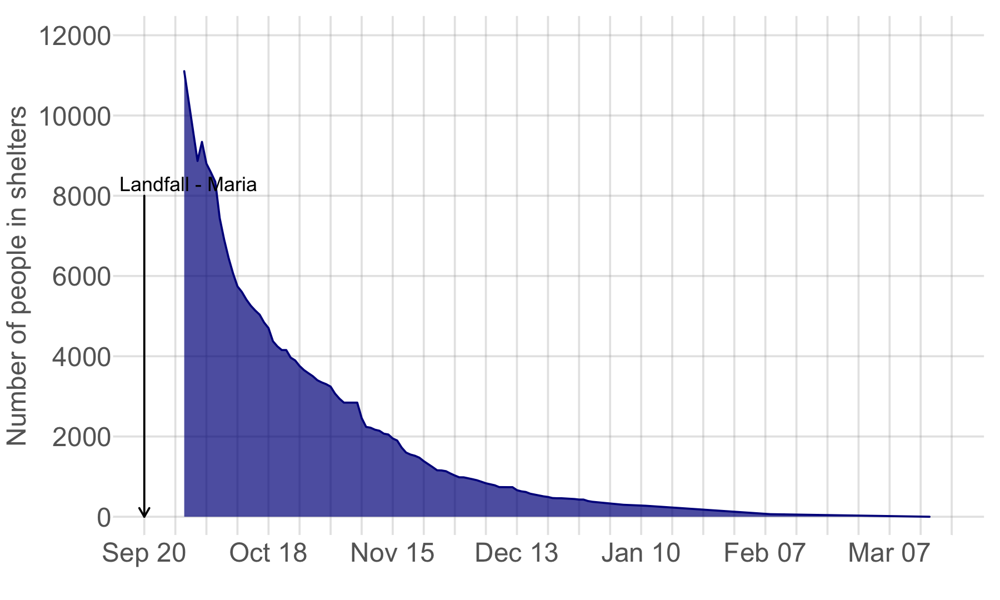

## Status Puerto Rico

This page tracks key indicators of progress in water, communications, hospitals, and shelters during Puerto Rico's recovery from Hurricane Maria. The data here are pulled from the goverment webpage [StatusPR](http://status.pr/). Progress on re-enerigizing the island is shown on the [Re-energinzing Puerto Rico](Electricity.md) page. 

The last update of this page was on October 26, 2017 - 35 days after the hurricane.

#### Water supply
Approximately 20% of the clients still had no water and a boil advisory remained in place for all who did.

#### Communications
More than 30% of the island still had no wireless or wired telecommunication. Approximately 60% of cellular towers were functioning, but only one third of all cellular antennas.

#### Hospitals
Many hospitals were still running exclusively on generators.

#### Shelters
While more than half of the people originally in shelters have moved elsewhere, more than 3,500 remained in shelters.

